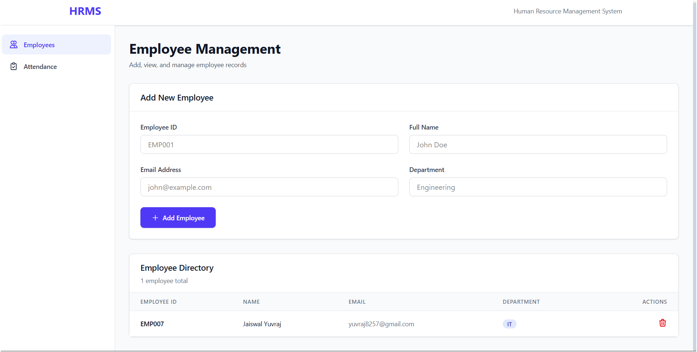
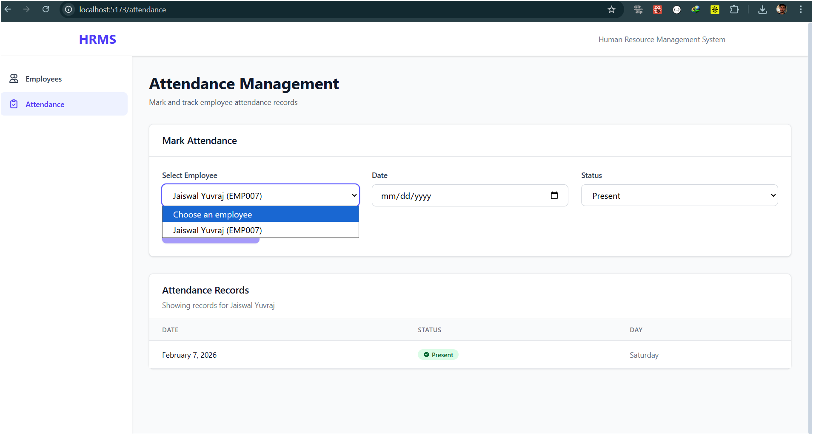

# HRMS Lite — Full Stack Assessment Project

## Overview

**HRMS Lite** is a lightweight Human Resource Management System designed to manage employee records and track daily attendance.
This project was developed as part of a full-stack technical assessment to demonstrate end-to-end development capability including backend API design, database modeling, frontend integration, deployment, and production readiness.

The system simulates a basic internal HR tool with a clean and functional interface, focusing on stability, usability, and correct implementation rather than excessive features.

---

## Live Application

**Frontend (Live):**
[`Frontend`](https://human-resource-management-system-br.vercel.app/)

**Backend API (Live):**
[`Backend`](https://hrms-backend-fn87.onrender.com)

---

## Features

### Employee Management

* Add new employee
* View all employees
* Delete employee
* Unique employee ID enforcement
* Email format validation
* Duplicate prevention

### Attendance Management

* Mark daily attendance (Present / Absent)
* Prevent duplicate attendance for same date
* View attendance history per employee
* Cascade delete attendance when employee removed

### System Features

* RESTful API architecture
* MySQL relational database
* Server-side validation
* Proper HTTP status codes & error handling
* Loading, empty, and error UI states
* Clean, modular, production-style code structure
* Fully deployed frontend and backend

---

## Screenshots

### Employee Management



---

### Attendance Management



---

## Tech Stack

### Frontend

* React (Vite)
* Axios
* React Router
* CSS (Minimal clean UI)

### Backend

* FastAPI
* SQLAlchemy ORM
* Pydantic Validation
* MySQL (Relational Database)

### Deployment

* Frontend: Vercel
* Backend: Render
* Database: MySQL

---

## API Endpoints

### Employees

| Method | Endpoint               | Description     |
| ------ | ---------------------- | --------------- |
| POST   | /api/v1/employees      | Create employee |
| GET    | /api/v1/employees      | List employees  |
| DELETE | /api/v1/employees/{id} | Delete employee |

### Attendance

| Method | Endpoint                         | Description     |
| ------ | -------------------------------- | --------------- |
| POST   | /api/v1/attendance               | Mark attendance |
| GET    | /api/v1/attendance/{employee_id} | View attendance |

---

## Run Locally

### 1. Clone Repository

```
git clone https://github.com/YuvrajJais9257/human_resource_management_system_BRAVIA.git
cd hrms
git checkout main
git pull origin main
```

---

### 2. Backend Setup

```
cd backend
python -m venv .venv
.venv\Scripts\activate   # Windows
pip install -r requirements.txt
```

Create `.env` file:

```
DB_USER=your_user
DB_PASS=your_password
DB_HOST=localhost
DB_NAME=human_resources
```

Run server:

```
uvicorn app.main:app --reload
```

Backend runs at:

```
http://127.0.0.1:8000
```

---

### 3. Frontend Setup

```
cd frontend
npm install
npm run dev
```

Frontend runs at:

```
http://localhost:5173
```

---

## Database Design

### Employees

* id (Primary Key)
* employee_id (Unique)
* name
* email (Unique)
* department
* created_at

### Attendance

* id (Primary Key)
* employee_id (Foreign Key)
* date
* status (Present / Absent)
* UNIQUE(employee_id, date)

---

## Assumptions & Limitations

* Single admin user (no authentication required)
* No payroll or leave management (out of scope)
* Minimal UI focusing on functionality and stability
* SQLite/MySQL used depending on environment
* No pagination due to small dataset

---

## Project Structure

```
backend/
 ├── app/
 │   ├── main.py
 │   ├── models.py
 │   ├── schemas.py
 │   ├── crud.py
 │   ├── routers/
 │   └── utils/
 ├── requirements.txt
 └── .env

frontend/
 ├── src/
 │   ├── api/
 │   │   └── api.js
 │   ├── pages/
 │   │   ├── Employees.jsx
 │   │   └── Attendance.jsx
 │   ├── components/
 │   │   ├── EmployeeForm.jsx
 │   │   ├── EmployeeTable.jsx
 │   │   ├── AttendanceForm.jsx
 │   │   └── AttendanceTable.jsx
 │   └── App.jsx
 ├── package.json
 └── vite.config.js
```

---

## Deployment Notes

* Backend deployed on Render using Uvicorn
* Frontend deployed on Vercel
* Environment variables configured securely
* Application tested end-to-end on production
* All routes functional with no broken flows

---

## Author

**Yuvraj**
Full Stack Developer

---

## Conclusion

This project demonstrates practical full-stack development capability including:

* Backend API design
* Database modeling
* Frontend integration
* Error handling & validation
* Deployment & production readiness

The focus was on building a clean, stable, and functional system suitable for real-world usage rather than over-engineering.

---
